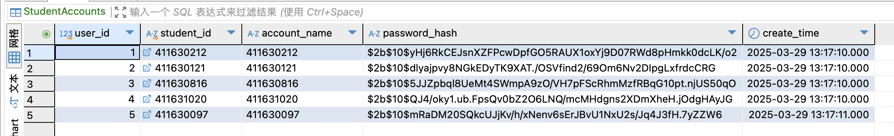
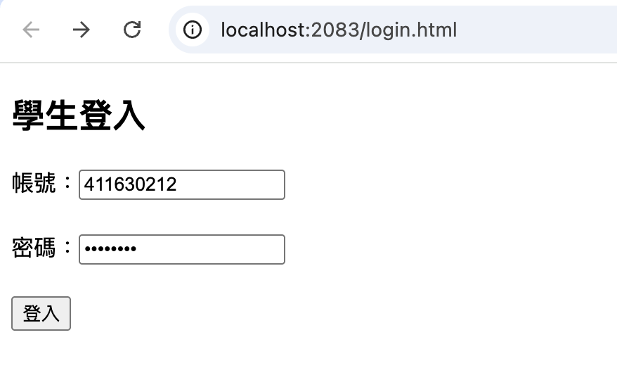
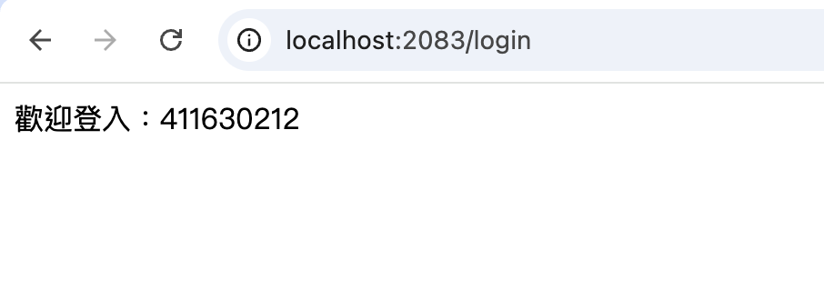

# 簡易的登入頁面 （使用 Node.js + bcrypt）
### 1. 使用 `npm install express mysql2 bcrypt dotenv` 安裝必要的套件
### 2. 使用 `node insert_accounts.js` 初始化帳號

* 成功新增帳號

* 成功後到資料庫裡查看資料表內容

### 3. 使用 `node server.js` 啟動伺服器

* 頁面展示

* 登入成功
